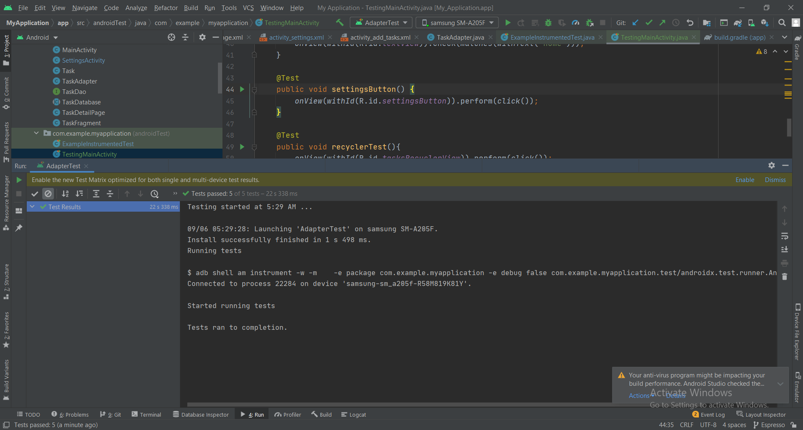

# Task-Master

## **Lab26**
The application should include those 3 activities:
+ **Homepage**
The main page should be built out to match the wireframe. In particular, it should have a heading at the top of the page, an image to mock the “my tasks” view, and buttons at the bottom of the page to allow going to the “add tasks” and “all tasks” page.

+ **Add a Task**
On the “Add a Task” page, allow users to type in details about a new task, specifically a title and a body. When users click the “submit” button, show a “submitted!” label on the page.

+ **All Tasks**
The all tasks page should just be an image with a back button; it needs no functionality.

## **Lab27**
The application should include those 3 activities:

+ **Task Detail Page**
Create a Task Detail page. It should have a title at the top of the page, and a Lorem Ipsum description.

+ **Settings Page**
Create a Settings page. It should allow users to enter their username and hit save.

+ **Homepage**
The main page should be modified to contain three different buttons with hardcoded task titles. When a user taps one of the titles, it should go to the Task Detail page, and the title at the top of the page should match the task title that was tapped on the previous page.

The homepage should also contain a button to visit the Settings page, and once the user has entered their username, it should display “{username}’s tasks” above the three task buttons.

 

## **Lab28**
The application should include those 3 activities:

+ **Homepage**
The main page should be modified to contain a rendered list inside a recycler view with hardcoded task titles. When a user taps one of the titles, it should go to the Task Detail page, and the title at the top of the page should match the task title that was tapped on the previous page.

+ **Task Detail Page**
Create a Task Detail page. It should have a title at the top of the page, and a Lorem Ipsum description.

+ **Settings Page**
Create a Settings page. It should allow users to enter their username and hit save.

The homepage should also contain a button to visit the Settings page, and once the user has entered their username, it should display “{username}’s tasks” above the three task buttons.

## **Lab29**
The application should include those 4 activities:

+ **Homepage**
The main page should be modified to contain a rendered list of tasks (title and state) inside a recycler view which are retrieved from the Room database. When a user taps one of the titles, it should go to the Task Detail page, which desplays the task title, state and body. Also it has a button to navigate to the AddTask activity.

+ **AddTask**
In this activity you can add a new task my adding it's title, body and state in the input fields, and click submit. The data will be stored inside the Room database.

+ **Task Detail Page**
Create a Task Detail page. It should have a title at the top of the page, with the state beside it, and the body underneath.

+ **Settings Page**
Create a Settings page. It should allow users to enter their username and hit save.

The homepage should also contain a button to visit the Settings page, and once the user has entered their username, it should display “{username}’s tasks” above the three task buttons.

 

## **Lab30**
The application should include the same activities as the last lab, but it also includes UI tests from Espresso library that are working fine.

 

